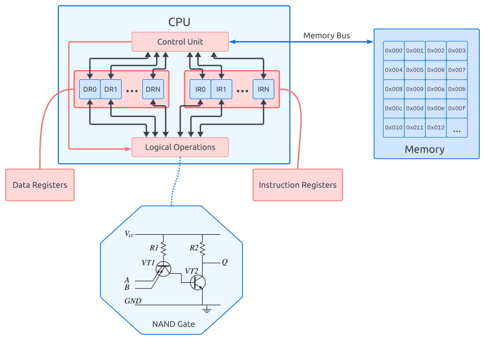
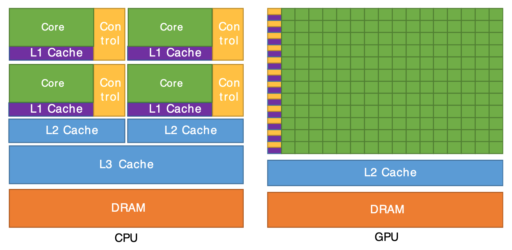
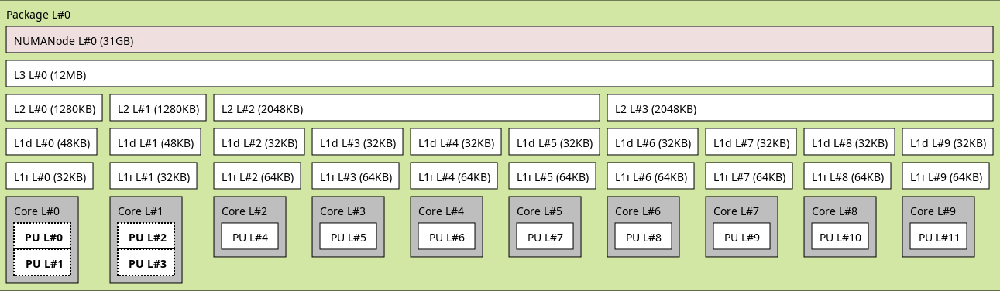
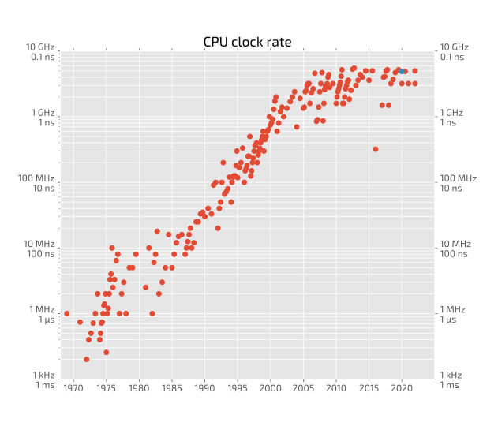
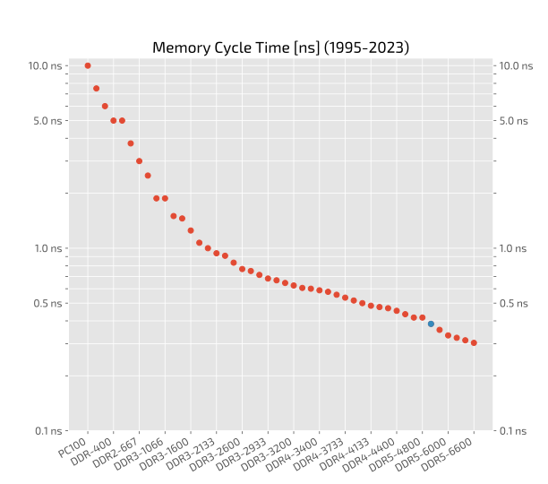
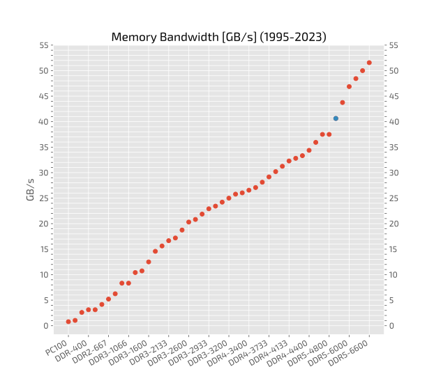
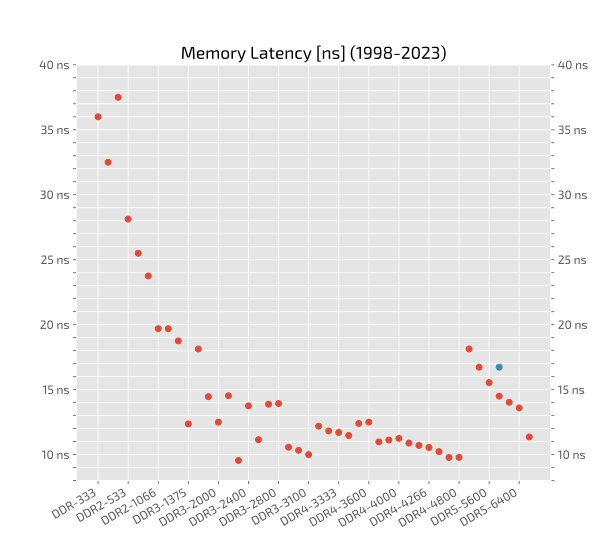
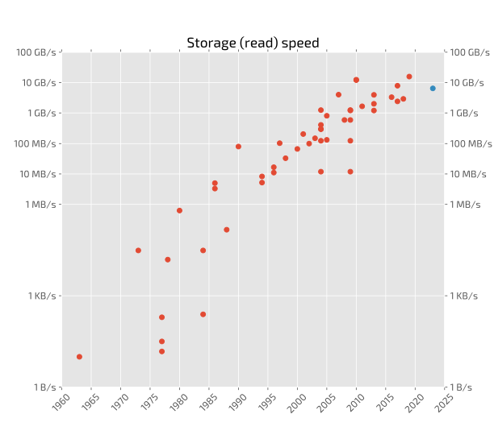

# A Primer on computer architecture

## Binary representation of common data types
- **integers**
  - int32 ➔ 32b (bits) = 4B (bytes)
  - 1 bit for sign, 31 bit for magnitude
  - min = -2^31 = -2,147,483,648
  - max = 2^31-1 = 2,147,483,647
  - [visualization](https://manderc.com/apps/umrechner/index_eng.php)
  - In Python:
    - `bin(14)` ➔ `'0b1110'`
    - `np.iinfo(np.int32)` ➔ `iinfo(min=-2147483648, max=2147483647, dtype=int32)`
    - Python integers, as opposed to numpy integer types, are represented with a flexible number of bits: `sys.int_info` ➔ `bits_per_digit=30, sizeof_digit=4, default_max_str_digits=4300, str_digits_check_threshold=640`
      - they are called "long" or "sperlong" integers, because they can have arbitrary size. Low level implementation explained:
        - [Arpit Bhayani's blog](https://arpitbhayani.me/blogs/long-integers-python/)
        - [Artem Golubin's blog](https://rushter.com/blog/python-integer-implementation/)

- **real numbers**, a.k.a. floating point numbers (IEEE-754 standard):
  - float64 ➔ 64b (bits) = 8B (bytes)
  - 1 bit for sign, 51 bits for mantissa, 11 bits for exponent
  - min, max ≈ ± 1.8 × 10^308
  - smallest ≈ 2.2 x 10^-308
  - example in Python:
    - `np.finfo(np.float64)` ➔ `finfo(resolution=1e-15, min=-1.7976931348623157e+308, max=1.7976931348623157e+308, dtype=float64)`
    - `sys.float_info` ➔ `max=1.7976931348623157e+308, max_exp=1024, max_10_exp=308, min=2.2250738585072014e-308, min_exp=-1021, min_10_exp=-307, dig=15, mant_dig=53, epsilon=2.220446049250313e-16, radix=2, rounds=1`
  - next floating point number after `1.` in the direction of `2.`: `np.nextafter(1., 2.)` ➔ `1.0000000000000002`
  - watch out for equality between floating point numbers:
     - `1.1 + 2.2 == 3.3` ➔ `False`
     - `(1.1+2.2).hex()` ➔ `0x1.a666666666667p+1` and `(3.3).hex()` ➔ `0x1.a666666666666p+1` 
  - visualization:
    - [`float32`](https://www.h-schmidt.net/FloatConverter/IEEE754.html)
    - [all types](https://float.exposed/) with [explanation](https://ciechanow.ski/exposing-floating-point/)
  - Docs with more details: [What Every Programmer Should Know About Floating-Point Arithmetic or Why don’t my numbers add up?](https://floating-point-gui.de)
  - Docs with the gory details, a.k.a. the floating point bible: [What every computer scientist should know about floating-point arithmetic](https://doi.org/10.1145/103162.103163)

- **strings**:
  - UTF8 encoded, flexible width from 1B (byte) to 4B (bytes): 1,112,064 Unicode characters (code points)
  - ASCII: 7 bits (fits in one byte), 127 characters ➔ [ASCII table](https://upload.wikimedia.org/wikipedia/commons/2/26/ASCII_Table_%28suitable_for_printing%29.svg)
  - [visualization](https://sonarsource.github.io/utf8-visualizer/)
  - actually in Python strings (more precisely: unicode objects) are stored in different formats depending on which characters are stored for memory efficiency. Look at the gory details [here](https://docs.python.org/3.14/c-api/unicode.html) ➔ not for the faint-hearted!

- **hexadecimal notation**:
  - base16 ➔ '0, 1, 2, 3, 4, 5, 6, 7, 8, 9, a, b, c, d, e, f'
  - a compact way of representating binary data: 8 bits = 1 byte = 2 hexadecimal digits
  - Example: `254` (decimal) ➔ `1111 1110` (binary) ➔ `fe` (hex)

## CPU architecture

 - Primer on CPU (x86_64) architecture and the memory hierarchy:
    - CPU registers ≈ 160 (plus another ~500 model specific), latency: 0 cycles, capacity: 8 bytes
    - x86-64 instruction set, with ≈ 2000 instructions with mnemonic (plus an unknown number of "undocumented" instructions ~ 10k)
    - (single instruction, mutiple data [8 or 16 data units]) SIMD CPUs
    - L-Caches: L1/L2/L3, with cache lines of 128B, latencies: 1-40 cycles, capacity:  ~KB and ~MB
    - Main memory: RAM pages 4KB or 64KB, latency: 50~100 cycles, capacity ~GBs
    - Storage (local disks): disk transfer blocks 4KB to 64MB, latency: 0.1ms (300k cycles), capacity: ~TBs
    - Remote Storage (network): typically limited by ethernet connection (1-10 GB/s), latency: 10~100 ms, capacity: ∞
  - Understand the trade-offs involved:
      - **capacity** measured in T/G/M/K/B
      - **latency** ≈ (time-when-data-available-on-output-pins – time-when-data-requested) ➔ measured in nanoseconds or in (CPU) cycles
      - **bandwidth** ≈ clock frequency × data-transfer/tick × bus-width (in bytes) ➔ measured in T/G/M/K/B per second (this is what is usually advertised as the **speed**)
      - data **volatility** vs. **persistence**
      - cost
      - physical limits (heat dissipation, density, size, lifetime)
      - temporal and spacial locality of data
  - The gory details about the memory hierarchy: [What Every Programmer Should Know About Memory](https://www.akkadia.org/drepper/cpumemory.pdf) by the notorious Ulrich Drepper

# …and what about the GPU?

  - A GPU has many (in the order of hundreds) SIMT (single instruction, multiple thread) cores, so called SMs (Streaming Multiprocessors), each one with local L1 and shared L2 caches, and shared RAM (due to to the high parallelism, with huge bandwidth, in the order of ~1TB/s
  - The SMs are specialized on data types. In order of abundance, the following data types are supported: int8, int32, int64, float16, float32, float64
  - Performance depends on:
    - memory bandwidth: usually higher than CPU's RAM
    - "math" bandwidth: usually higher than CPU's, but much more limited in capability; for example branches (if/else) are expensive
    - latency: usually much higher than  CPU's ➔ the more parallel threads are run the less the price of high latency is paid (latency "hiding") 
    - spatial locality is extremely critical
  - A portion of the GPU-RAM is accessible to the CPU ➔ the GPU performs the copies
  - The PCI-Bus (Peripheral Component Interconnect bus) is the bottleneck: data needs to flow from main (CPU) memory to GPU memory and back!
  - Problems on a cluster: the GPU does not really support simultanous multiple users payloads!

# Computer Architecture (a concrete example)
My Laptop:

  - Lenovo - T14 Gen 4
  - CPU i7-1365U: 
    - 2× "performance cores" (Intel Core) max 5.20 GHz (0.19 ns/cycle) with Hyper-Threading
    - 8× "efficient cores" (Intel Atom) max 3.90 GHz (0.26 ns/cycle)
  - L1 (data) cache P-Core 48 KB
  - L1 (data) cache E-Core 32 KB
  - L2 cache P-Core 1280 KB
  - L2 cache E-Core 2048 KB (shared x4)
  - L3 cache 12 MB (shared P+E-Cores)
  - RAM DDR5-5200: 32GB (16GB soldered + 16GB bank):
    - Data rate 5200 MT/s, Transfer time 0.192 ns/cycle
    - Command rate (bus clock) 2600 MHz, Cycle time 0.385 ns
    - Internal clock 650 MHz, 1.54 ns
    - CAS Latency 34 cycles, Total latency = CAS latency x cycle = 13.09 ns, Throughput 40.6 GB/s
  - DMI (Direct Media Interface): 8×16 GT/s (≈128 GB/s)
  - PCI (Peripheral Component Interconnect) Express bridges:
    - Graphics: 16 GT/s (≈ 8 GB/s)
    - 2× Thunderbolt: 2.5 GT/s (≈ 1 GB/s) and 16 GT/s (≈ 8 GB/s)
  - GPU Intel Iris, Internal clock 300 Mhz-1.30 GHz, memory 4 GB/2.1 GHz with a bandwidth of 68 GB/s

## Historical evolution of speed of different components in a computer
(data source: Wikipedia)

### CPU Clock Rate

### Memory (RAM) Clock Cycle Time

### Memory (RAM) Bandwidth

### Memory (RAM) Latency

### Storage Read Speed

