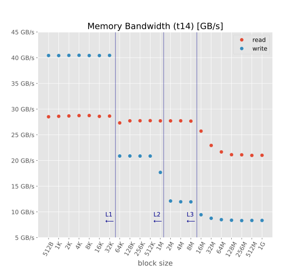
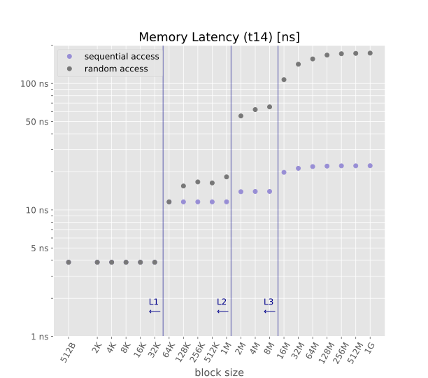

# Low Level Memory Benchmark

These are the results of a low level memory benchmark (written in C) on my [laptop](../architecture/README.md)

## Summary plots (details below)



## Benchmarks details:

  - Bandwidth (read), [bw_mem_rd](http://lmbench.sourceforge.net/man/bw_mem_rd.8.html). Allocate the specified amount of memory, zero it, and then time the reading of that memory as a series of integer loads and adds. Each 4-byte integer is loaded and added to accumulator. 

    [Results](t14-bwr.csv) (block size in MB, bandwith in MB/s)
  - Bandwidth (write),[bw_mem](http://lmbench.sourceforge.net/man/bw_mem.8.html). Allocate twice the specified amount of memory, zero it, and then time the copying of the first half to the second half. 

    [Results](t14-bww.csv) (block size in MB, bandwith in MB/s)
  - Latency (sequential access), [lat_mem_rd](http://lmbench.sourceforge.net/man/lat_mem_rd.8.html). Run two nested loops. The outer loop is the stride size of 128 bytes. The inner loop is the block size. For each block size, create a ring of pointers that point backward one stride. Traverse the block by `p = (char **)*p` in a for loop and time the load ladency over block. 

    [Results](t14-lseq.csv) (block size in MB, latency in ns)
  - Latency (random access). Like above, but with a stride size of 16 bytes. 

    [Results](t14-lrnd.csv) (block size in MB, latency in ns)

## Running the benchmarks on Linux:
  - You need the [lmbench](http://lmbench.sourceforge.net/) library and [cpuset](https://github.com/SUSE/cpuset)
  - All commands must be run as root after having killed as many processes/services as possible, so that the CPUs are almost idle
  - Disable address space randomization:
    ```bash
    echo 0 > /proc/sys/kernel/randomize_va_space
    ```
  - Set scaling governor to performance for CPU0:
    ```bash
    echo performance > /sys/devices/system/cpu/cpu0/cpufreq/scaling_governor
    ```
  - Reserve CPU 0 fro our benchmark, i.e. kick out (almost) all other processes
    ```bash
    cset shield --cpu 0 --kthread=on
    ```
  - If you are on INTEL and CPU0 is part of a SMT-pair (hyperthreading), disable the peer
    ```bash
    echo 0 > /sys/devices/system/cpu/cpu1/online
    ```
  - Disable turbo mode on INTEL:
    ```bash
    echo 1 > /sys/devices/system/cpu/intel_pstate/no_turbo
    ```
  - Run the configuration script for lmbench. Select only the `HARDWARE` set of benchmarks and set the maximum amount of memory to something like 1024MB
    ```bash
    cd /usr/lib/lmbench/scripts
    # the following command will create the configuration file /usr/lib/lmbench/bin/x86_64-linux-gnu/CONFIG.<hostname>
    cset shield --exec -- ./config-run
    # run the benchmark
    cset shield --exec -- /usr/bin/lmbench-run
    # results are in /var/lib/lmbench/results/x86_64-linux-gnu/<hostname>
    ```


