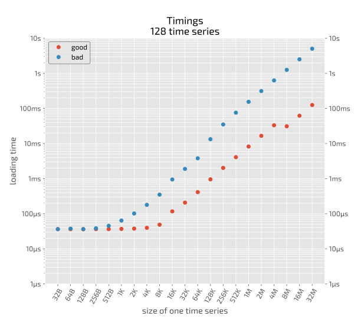
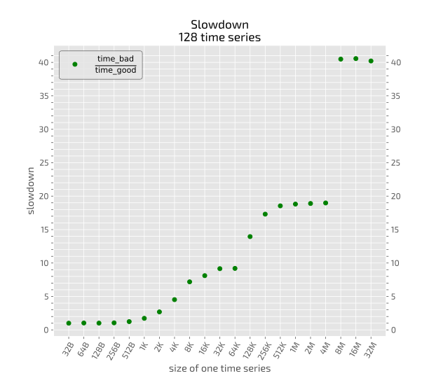

## Benchmark



## Benchmarks details

  - Create in memory a list of `N=128` one dimensional numpy arrays of length `L` starting from `L=2` up to `L=2^22=4_194_304` in steps of powers of two.
  - Given that each item of the array is of type `float64`, i.e. 8 bytes, the size of the arrays goes from `16B` to `32M`
  - The total memory required is at least `128 × 32M × 2 = 8G`
  - Load the whole list in one big numpy array of size `N`x`L` (*good*) and `L`x`N` (*bad*). The corresponding loops are: 
    ```python
    # good loop (store each time series on a different row)
    for row, time_series in enumerate(collection):
        ts[row, :] = time_series
    ```

    ```python
    # bad loop (store each time series on a different column)
    for column, time_series in enumerate(collection):
        ts[:, column] = time_series
    ```
  - Time the *bad* and the *good* loop
  - Plot the timings for the *good* and the *bad* loop as a function of `L`
  - Plot `slowdown = time_bad/time_good` as a function of `L`

## Scripts

  - [Benchmark script](bench.py) and [measurements](results_ns128)
  - [Plotting script](bench_plot.py)
