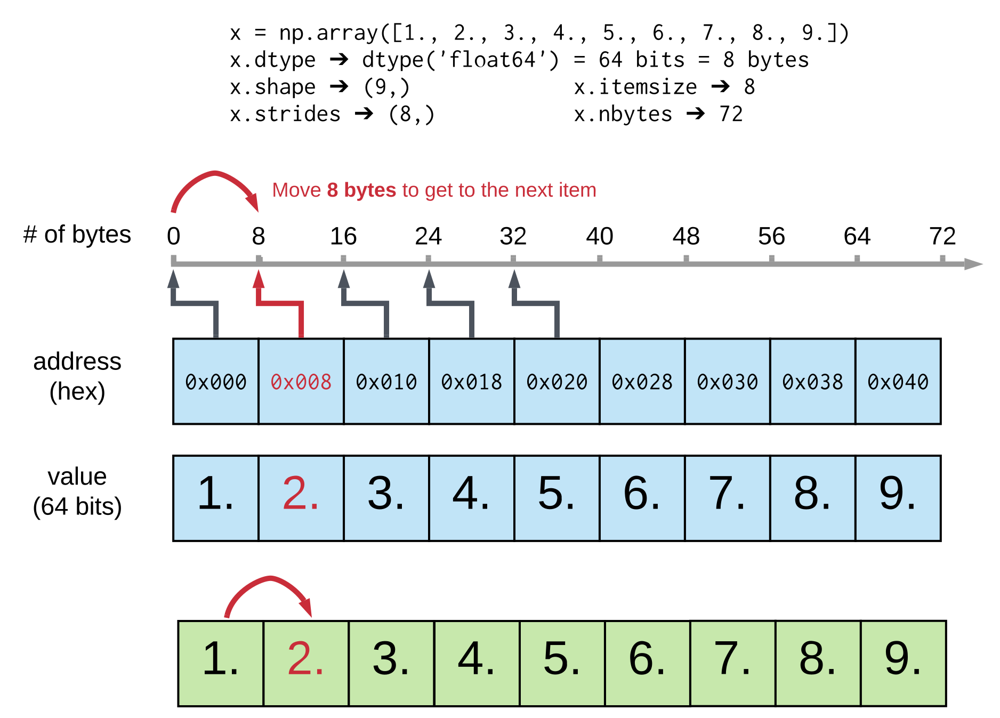
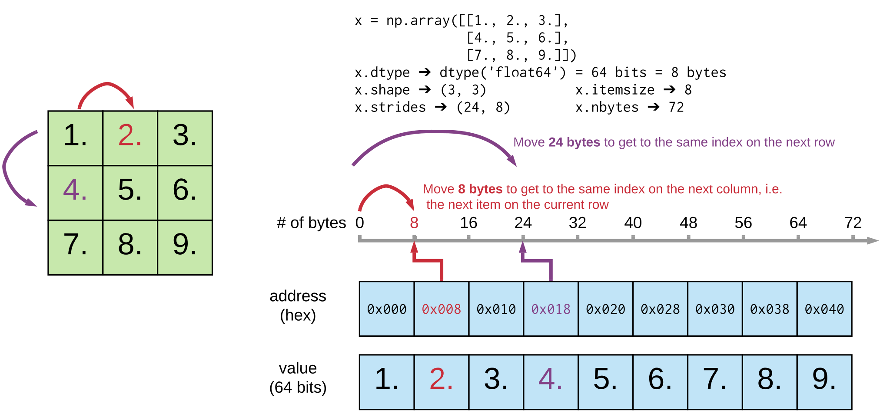
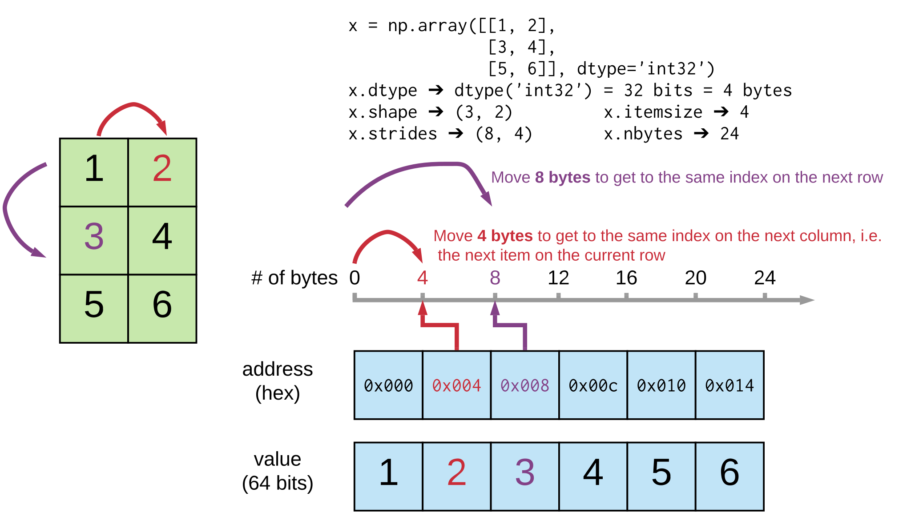
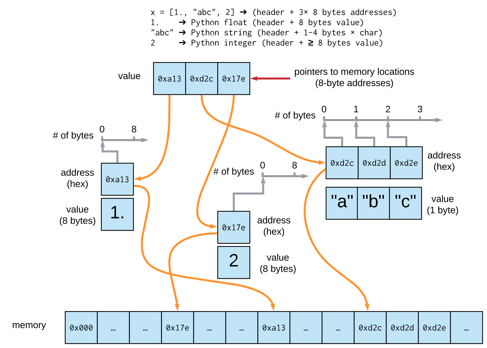

# Anatomy of a numpy array
## one dimension, float64

## two dimensions, square, float64

## two dimensions, rectangular, int32

## what about Python lists?

## interesting attributes of numpy arrays
  - `x.data`, `x.data.hex()`, `x.data.format`, `x.tobytes()`
  - `x.flags`:
    - `OWNDATA`
    - `C_CONTIGUOUS`
    - `F_CONTIGUOUS`
    - more [flags](https://numpy.org/doc/stable/reference/generated/numpy.ndarray.flags.html)

## If your arrays are bigger than RAM
  - [`numpy.memmap`](https://numpy.org/doc/stable/reference/generated/numpy.memmap.html): an array-like
      object that maps memory to an array stored on disk, used for accessing small segments of large
      files on disk, without reading the entire file into memory. Use with caution!

  - [`HDF5`](https://support.hdfgroup.org/documentation/hdf5/latest/_intro_h_d_f5.html): hierarchical
      data format, with aribitrary metadata and multilanguage support
      with [`h5py`](https://docs.h5py.org/en/stable/) with an array-lie interface
  - other projects, for example [`xarray`](https://docs.xarray.dev/en/stable/) 
      and [`zarr`](https://zarr.readthedocs.io/en/stable/)
